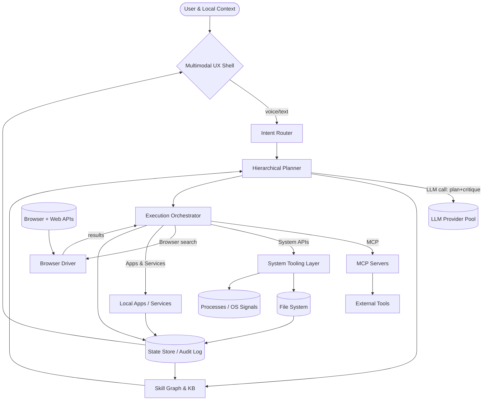

Optimizing tool selection...

Created 3 todos

Fetching Mermaid documentation for flowchart.md
Completed with input: {
  "file": "flowchart.md"
}

Validating Mermaid diagram syntax
Completed with input: {
  "code": "flowchart TD\n    user([User & Local Context]) --> shell{Multimodal UX Shell}\n    shell -->|voice/text| intent[Intent Router]\n    intent --> planner[Hierarchical Planner]\n    planner -->|LLM call: plan+critique| llm[(LLM Provider Pool)]\n    planner --> skills[Skill Graph & KB]\n    skills --> planner\n    planner --> exec[Execution Orchestrator]\n    exec -->|MCP| mcp[MCP Servers]\n    exec -->|System APIs| sys[System Tooling Layer]\n    exec -->|Browser search| web[Browser Driver]\n    exec -->|Apps & Services| apps[Local Apps / Services]\n    sys --> files[(File System)]\n    sys --> procs[(Processes / OS Signals)]\n    mcp --> tools[External Tools]\n    browser[(Browser + Web APIs)] --> web\n    web -->|results| exec\n    exec --> state[(State Store / Audit Log)]\n    state --> skills\n    state --> shell\n    apps --> state\n    files --> state"
}

Opening Mermaid diagram preview
Completed with input: {
  "code": "flowchart TD\n    user([User & Local Context]) --> shell{Multimodal UX Shell}\n    shell -->|voice/text| intent[Intent Router]\n    intent --> planner[Hierarchical Planner]\n    planner -->|LLM call: plan+critique| llm[(LLM Provider Pool)]\n    planner --> skills[Skill Graph & KB]\n    skills --> planner\n    planner --> exec[Execution Orchestrator]\n    exec -->|MCP| mcp[MCP Servers]\n    exec -->|System APIs| sys[System Tooling Layer]\n    exec -->|Browser search| web[Browser Driver]\n    exec -->|Apps & Services| apps[Local Apps / Services]\n    sys --> files[(File System)]\n    sys --> procs[(Processes / OS Signals)]\n    mcp --> tools[External Tools]\n    browser[(Browser + Web APIs)] --> web\n    web -->|results| exec\n    exec --> state[(State Store / Audit Log)]\n    state --> skills\n    state --> shell\n    apps --> state\n    files --> state"
}

Completed: *Gather requirements & constraints* (1/3)

**Requirements**

- Functional: local LLM-orchestrated assistant must (1) index and read/write any user-approved files, (2) invoke OS-level tools (shell, package managers, git, etc.), (3) automate GUI/CLI apps, (4) browse/search the web when local knowledge is insufficient, (5) call MCP servers for specialized providers (repos, calendars, telemetry), (6) plan multi-step tasks, (7) capture execution trace plus artifacts into a durable knowledge base/skill graph, and (8) expose a multi-modal UX (text, voice, UI embeds) with permission gating.
- Non-functional: fully offline-first with pluggable remote fallback, strong sandboxing (per-directory capability tokens, network allow-lists), deterministic auditing (every tool call logged with diff & result), modular connectors (LLM swap, browser driver swap, MCP add/remove without touching planner), resilient long-running sessions (checkpoint/resume), and extensible schema for “skills” (capability metadata, confidence, usage cost).
- Technology targets: Bun/Node host for orchestration, containerized sidecars for privileged tooling, SQLite/Weaviate for KB embeddings + symbolic facts, LLM adapter layer (OpenAI SDK, local GGUF runners, etc.), MCP client SDK, headless browser (Playwright) for search/execution, privilege broker for sudo/system APIs.

**Architecture Building Blocks**

- Multimodal UX Shell: local TUI/web panel capturing prompts, voice, and streaming responses; enforces permissions before escalations.
- Intent Router: classifies inbound requests (question, plan, retrieve, execute) using lightweight LLM heuristics, tags safety level.
- Hierarchical Planner: expands intents into steps, critiques via second LLM pass, emits DAG annotated with required capabilities, guardrails, and rollback hooks.
- Skill Graph & Knowledge Base: hybrid store combining structured facts (skill definitions, tool metadata, run logs) with vector search over documents, previous sessions, and web captures; auto-updates skill confidence after each run.
- Execution Orchestrator: interprets planner DAG, schedules tool runs, streams telemetry; handles retries, state checkpointing, and context distillation back into the planner/UX.
- Connectors:
  - MCP Layer for standardized external resources (git repos, ticketing, calendars).
  - System Tooling Layer for local shell, file I/O, process control, package managers, GPU jobs.
  - Browser Driver for search, scraping, form fills; isolates cookies/profiles per request.
  - App/Service Adapters for native apps (via AppleScript, Win32 UIA, DBus) and local APIs.
- State Store & Audit Log: append-only event store plus content cache; feeds observability, dispute resolution, and knowledge ingestion loops.

**Delivery Plan**

1. Discovery & Threat Modeling: confirm OS targets, privilege boundaries, preferred LLM providers, and data-classification rules; define MCP servers to integrate first.
2. Knowledge Base & Skill Schema: design entities (Skill, Tool, Run, Artifact, ContextSnapshot), choose storage, seed with initial skills (file edit, browser search, MCP fetch).
3. Core Runtime: stand up UX shell, intent router, planner, and orchestrator skeleton with mocked connectors.
4. Connector Iterations: implement system tooling wrapper (fs, shell, process), MCP client, and browser driver; each ships with contract tests and fallback stubs.
5. Governance Layer: permission prompts, sandbox enforcement, audit logging, rollback helpers, and automated state-to-skill updates.
6. Evaluation & Tuning: run scripted scenarios (repo refactor, research task, multi-app workflow), capture telemetry, adjust planning heuristics, expand skill library.
7. Packaging: create installer/launcher, define secure defaults, document extension points (custom tools, new MCP servers, alternative LLMs).

**Interaction Model**

- Inbound flows: User → UX Shell → Intent Router → Planner, enriched with KB recall; planner consults LLM(s) plus Knowledge Base to craft actionable steps.
- Execution: Planner hands DAG to Orchestrator, which decides connector (MCP, system tools, browser, apps) per step; each connector returns artifacts that feed the State Store and optionally loop back to Planner for reflection.
- Outbound flows: Orchestrator emits logs back to UX shell, updates KB (new skills, embeddings), notifies user when approvals needed, and can trigger OS-level notifications or app automations.
- External dependencies: LLM calls for planning/critiquing, MCP RPCs for structured data, browser automation for search/evidence gathering—all mediated by capability tokens and recorded in the audit log for reproducibility.

**Interaction Diagram**

**Next Steps**

1. Decide target OS scope (Windows vs macOS vs Linux) and pick the initial privileged automation APIs.
2. Select LLM providers/runtimes and MCP servers to support first so connector sequencing is clear.
3. Prototype the planner→orchestrator loop with a thin slice (file read + summarize) to validate logging, permissions, and knowledge updates.
